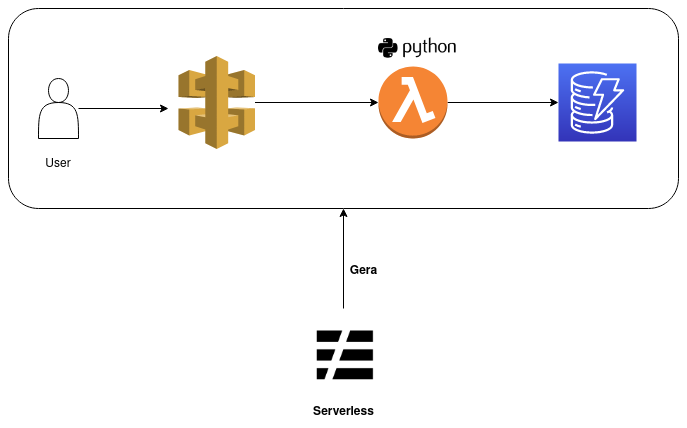

# Sobre

Repositório destinado ao estudo da ferramenta serverless , com o provedor aws e com lambda de interação com API Gateway.

Todos os objetos válidos , passados via **POST** são salvos em um banco Dynamodb rodando num docker (Imagem fornecida pela própria AWS).

# Para executar (Localmente)

**Necessário instalar (Para testes fora do container)**

- <code></code>

Após instalar o Node,executar:

    $ make node_req
    $ cd dynamodb-serverless ; make serverless_req

Abaixo temos algumas anotações a respeito de comandos do <code></code>:

## Comandos do serverless (Para execução fora do container)

**Obter informações da aplicação atual**

    $ sls info

**Para criar aplicação serverless com aws e python**

    $ serverless --template aws-python

**Executar uma função (lambda) localmente**

    $ sls invoke

**Executar o serveless localmente**

    $ sls offline

**Realizar Deploy:**

    $ sls deploy 
ou

    $ sls deploy -f function_name

ou 
    $ sls deploy --stage qa
    

Exemplo: serverless deploy --stage prod --region us-east-1

**Depurar localmente**

    $ sls logs -f function --tail

## Executar com docker compose

    $ make build & sudo chmod 777 ./docker/dynamodb & make up
